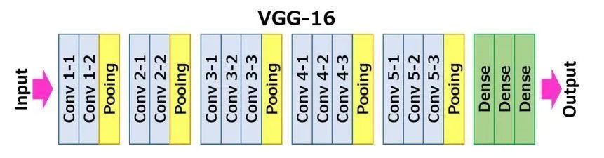

# CNN Visualization

## Question 2

### `VGG-16` archicture summary

`VGG-16` has 13 convolutional layers and 3 fully connected layers. Feeding an arbitrary image of size $(3 \times 32 \times 32)$ and we get the following summary alongside the output shapes and corresponding paramater count:

```txt
----------------------------------------------------------------
        Layer (type)               Output Shape         Param #
================================================================
            Conv2d-1           [-1, 64, 32, 32]           1,792
              ReLU-2           [-1, 64, 32, 32]               0
            Conv2d-3           [-1, 64, 32, 32]          36,928
              ReLU-4           [-1, 64, 32, 32]               0
         MaxPool2d-5           [-1, 64, 16, 16]               0
            Conv2d-6          [-1, 128, 16, 16]          73,856
              ReLU-7          [-1, 128, 16, 16]               0
            Conv2d-8          [-1, 128, 16, 16]         147,584
              ReLU-9          [-1, 128, 16, 16]               0
        MaxPool2d-10            [-1, 128, 8, 8]               0
           Conv2d-11            [-1, 256, 8, 8]         295,168
             ReLU-12            [-1, 256, 8, 8]               0
           Conv2d-13            [-1, 256, 8, 8]         590,080
             ReLU-14            [-1, 256, 8, 8]               0
           Conv2d-15            [-1, 256, 8, 8]         590,080
             ReLU-16            [-1, 256, 8, 8]               0
        MaxPool2d-17            [-1, 256, 4, 4]               0
           Conv2d-18            [-1, 512, 4, 4]       1,180,160
             ReLU-19            [-1, 512, 4, 4]               0
           Conv2d-20            [-1, 512, 4, 4]       2,359,808
             ReLU-21            [-1, 512, 4, 4]               0
           Conv2d-22            [-1, 512, 4, 4]       2,359,808
             ReLU-23            [-1, 512, 4, 4]               0
        MaxPool2d-24            [-1, 512, 2, 2]               0
           Conv2d-25            [-1, 512, 2, 2]       2,359,808
             ReLU-26            [-1, 512, 2, 2]               0
           Conv2d-27            [-1, 512, 2, 2]       2,359,808
             ReLU-28            [-1, 512, 2, 2]               0
           Conv2d-29            [-1, 512, 2, 2]       2,359,808
             ReLU-30            [-1, 512, 2, 2]               0
        MaxPool2d-31            [-1, 512, 1, 1]               0
AdaptiveAvgPool2d-32            [-1, 512, 7, 7]               0
           Linear-33                 [-1, 4096]     102,764,544
             ReLU-34                 [-1, 4096]               0
          Dropout-35                 [-1, 4096]               0
           Linear-36                 [-1, 4096]      16,781,312
             ReLU-37                 [-1, 4096]               0
          Dropout-38                 [-1, 4096]               0
           Linear-39                 [-1, 1000]       4,097,000
================================================================
Total params: 138,357,544
Trainable params: 138,357,544
Non-trainable params: 0
----------------------------------------------------------------
Input size (MB): 0.01
Forward/backward pass size (MB): 4.84
Params size (MB): 527.79
Estimated Total Size (MB): 532.65
----------------------------------------------------------------
```

Here is also the classic Pytorch Summary as it contains more information about the filters:

```txt
VGG(
  (features): Sequential(
    (0): Conv2d(3, 64, kernel_size=(3, 3), stride=(1, 1), padding=(1, 1))
    (1): ReLU(inplace=True)
    (2): Conv2d(64, 64, kernel_size=(3, 3), stride=(1, 1), padding=(1, 1))
    (3): ReLU(inplace=True)
    (4): MaxPool2d(kernel_size=2, stride=2, padding=0, dilation=1, ceil_mode=False)
    (5): Conv2d(64, 128, kernel_size=(3, 3), stride=(1, 1), padding=(1, 1))
    (6): ReLU(inplace=True)
    (7): Conv2d(128, 128, kernel_size=(3, 3), stride=(1, 1), padding=(1, 1))
    (8): ReLU(inplace=True)
    (9): MaxPool2d(kernel_size=2, stride=2, padding=0, dilation=1, ceil_mode=False)
    (10): Conv2d(128, 256, kernel_size=(3, 3), stride=(1, 1), padding=(1, 1))
    (11): ReLU(inplace=True)
    (12): Conv2d(256, 256, kernel_size=(3, 3), stride=(1, 1), padding=(1, 1))
    (13): ReLU(inplace=True)
    (14): Conv2d(256, 256, kernel_size=(3, 3), stride=(1, 1), padding=(1, 1))
    (15): ReLU(inplace=True)
    (16): MaxPool2d(kernel_size=2, stride=2, padding=0, dilation=1, ceil_mode=False)
    (17): Conv2d(256, 512, kernel_size=(3, 3), stride=(1, 1), padding=(1, 1))
    (18): ReLU(inplace=True)
    (19): Conv2d(512, 512, kernel_size=(3, 3), stride=(1, 1), padding=(1, 1))
    (20): ReLU(inplace=True)
    (21): Conv2d(512, 512, kernel_size=(3, 3), stride=(1, 1), padding=(1, 1))
    (22): ReLU(inplace=True)
    (23): MaxPool2d(kernel_size=2, stride=2, padding=0, dilation=1, ceil_mode=False)
    (24): Conv2d(512, 512, kernel_size=(3, 3), stride=(1, 1), padding=(1, 1))
    (25): ReLU(inplace=True)
    (26): Conv2d(512, 512, kernel_size=(3, 3), stride=(1, 1), padding=(1, 1))
    (27): ReLU(inplace=True)
    (28): Conv2d(512, 512, kernel_size=(3, 3), stride=(1, 1), padding=(1, 1))
    (29): ReLU(inplace=True)
    (30): MaxPool2d(kernel_size=2, stride=2, padding=0, dilation=1, ceil_mode=False)
  )
  (avgpool): AdaptiveAvgPool2d(output_size=(7, 7))
  (classifier): Sequential(
    (0): Linear(in_features=25088, out_features=4096, bias=True)
    (1): ReLU(inplace=True)
    (2): Dropout(p=0.5, inplace=False)
    (3): Linear(in_features=4096, out_features=4096, bias=True)
    (4): ReLU(inplace=True)
    (5): Dropout(p=0.5, inplace=False)
    (6): Linear(in_features=4096, out_features=1000, bias=True)
  )
)
```

### Using gradient techniques, find an input image that maximally excites the chosen filter.

Our team was interested in the multi-channel filter in `Conv 3-3`, it's the 7th convolution layer counting from the left.



In the previous architecture summary, `Conv 3-3` corresponds to `Conv2d-15` (the 7th convolution layer) in our architecture summary:

```txt
----------------------------------------------------------------
        Layer (type)               Output Shape         Param #
================================================================
           Conv2d-15            [-1, 256, 8, 8]         590,080
================================================================
```

Assuming the batch size being $1$, this layer accepts an input with shape: $(1 \times 256 \times 8 \times 8)$, convolves it with *256 filters*, and produces another tensor of shape $(1 \times 256 \times 8 \times 8)$.

# Helpful Resources

- [GitHub - ImageNet 2012 class labels](https://gist.github.com/yrevar/942d3a0ac09ec9e5eb3a)
- [Pytorch - Models and pre-trained weights](https://pytorch.org/vision/stable/models.html)
- [Pytorch - VGG16](https://pytorch.org/vision/main/models/generated/torchvision.models.vgg16.html)
- [Pytorch - Access weights of a specific module](https://discuss.pytorch.org/t/access-weights-of-a-specific-module-in-nn-sequential/3627)
- [Pytorch - How to access input/output activations of a layer given its parameters names](https://discuss.pytorch.org/t/how-can-l-load-my-best-model-as-a-feature-extractor-evaluator/17254/6)